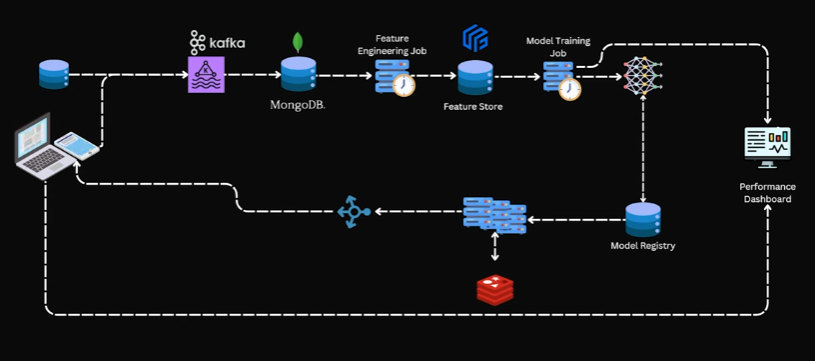

https://www.youtube.com/watch?v=90eszaYPskk

# Real-Time Credit Card Fraud Detection – System Design Deep Dive

Il progetto esplora l’architettura di un sistema di **real-time fraud detection** ispirato alle soluzioni adottate dai principali payment processor.  
L’obiettivo è garantire rapidità, affidabilità ed elevata precisione nel prevenire transazioni fraudolente, minimizzando i falsi positivi che peggiorano l’esperienza utente.

 

## 🎯 Goal
Prevenire transazioni fraudolente in tempo reale, garantendo al contempo una bassa incidenza di false segnalazioni.

Ogni grande circuito di pagamento (Visa, Mastercard, Stripe, ecc.) necessita di un sistema robusto per proteggere utenti e merchant da comportamenti anomali o fraudolenti.

 

## 📝 Requirements

### **Functional Requirements**
- **Real-time fraud detection**: il sistema deve decidere istantaneamente se approvare, bloccare o flaggare una transazione.
- **Cold start**: deve gestire nuovi utenti con poca o nessuna cronologia.
- **Feedback loop**: aggiornamento continuo del modello tramite nuovi dati etichettati (fraud/non fraud).
- **Risk scoring**: ogni transazione riceve uno score di rischio.

### **Non-Functional Requirements**
- **Low Latency**: le decisioni devono essere prese in millisecondi.
- **High Scalability**: milioni di transazioni giornaliere.
- **Precision/Recall Balance**: ridurre i falsi positivi senza perdere casi reali di frode.
- **High Reliability & Availability**: architettura resiliente, distribuita, fault-tolerant.

 

## 📊 Data Sources
Fonti dati tipiche per un sistema antifrode:

- Cronologia delle transazioni  
- Dati comportamentali dell’utente  
- Informazioni sul merchant  
- Blacklists e card-fraud databases  
- Credit scores  
- Device data  
- Geolocation events  

 

## 🏗️ Architecture Overview

L’architettura utilizza un approccio **event-driven** per elaborare in real time le transazioni e aggiornare le feature necessarie al modello.

 

## 🔁 Data Ingestion (Real-Time)

La piattaforma utilizza **Apache Kafka** come event streaming system.

Eventi tipici inviati a Kafka:
- transazione effettuata  
- login utente  
- pagamento ricorrente  
- cambio dispositivo  
- modifiche comportamentali  

Kafka consente:
- alta scalabilità  
- bassa latenza  
- trasporto affidabile degli eventi  

 

## 🗄️ Storage Layer

**MongoDB** viene utilizzato per:
- memorizzare transazioni storiche  
- archiviare raw events  
- fornire dati per calcoli batch e feature engineering  

 

## 🧮 Feature Engineering

Un job dedicato legge nuovi eventi dallo storage e calcola feature rilevanti:

### **Velocity Features**
- numero di transazioni in una finestra temporale  
- spike di spesa improvvisi  
- cambi anomali nel comportamento  

### **Geolocation Features**
- transazioni in luoghi distanti a breve distanza temporale  
- pattern inconsueti negli spostamenti  

### **Device Features**
- nuovo dispositivo mai visto  
- più account dallo stesso device (possibile abuso)  

### **Merchant & Category Features**
- categorie merceologiche insolite  
- merchant considerati ad alto rischio  

Le feature vengono poi inviate al **Feature Store**.

 

## 🏛️ Feature Store

Il sistema utilizza **Feast** per:

- salvare definizioni e versioni delle feature  
- garantire coerenza tra training e serving  
- servire feature online a bassa latenza  
- centralizzare feature condivise tra modelli diversi  

Feast elimina il rischio di *training–serving skew*.

 

## 🔐 Data Security

Misure essenziali:
- cifratura dei dati **at rest** e **in transit**  
- policy di accesso granulari (RBAC)  
- accesso degli sviluppatori solo a dati anonimizzati e GDPR-compliant  

 

## 🤖 Models

Il sistema usa due tipi di approccio:

### **1. Global Model**
Modello generale per tutti gli utenti.  
Utile per nuove registrazioni o utenti con pochi dati.

### **2. User-Specific Models**
Modelli adattati alle abitudini del singolo utente, più precisi e personalizzati.

### **Modeling Techniques**
- **Isolation Forest**  
  - modello non supervisionato  
  - eccellente per anomaly detection  
  - funziona bene con dataset sbilanciati  

Il modello viene salvato e versionato tramite **MLflow Model Registry**, che traccia:
- versioni  
- metriche  
- parametri  
- artefatti  

 

## ⚡ Serving Layer

Il modello viene servito tramite un inference service che:

- riceve la richiesta della transazione  
- recupera le feature dal Feature Store  
- carica la versione corretta del modello da MLflow  
- genera uno score di rischio in millisecondi  

### Redis Cache
La cache (es. Redis) può contenere:
- modelli generici pre-caricati  
- feature più richieste  
- store temporaneo per ridurre la latenza

Serve a rispondere istantaneamente senza caricare ogni volta il modello completo.

 

---

## 📌 Summary

Questo sistema garantisce:
- rilevazione in **tempo reale**  
- aggiornamento continuo dei modelli  
- scalabilità a volumi altissimi  
- robustezza e resilienza  
- coerenza tra training e serving  

È un’architettura moderna, modulare e tipica delle grandi piattaforme di pagamento.
